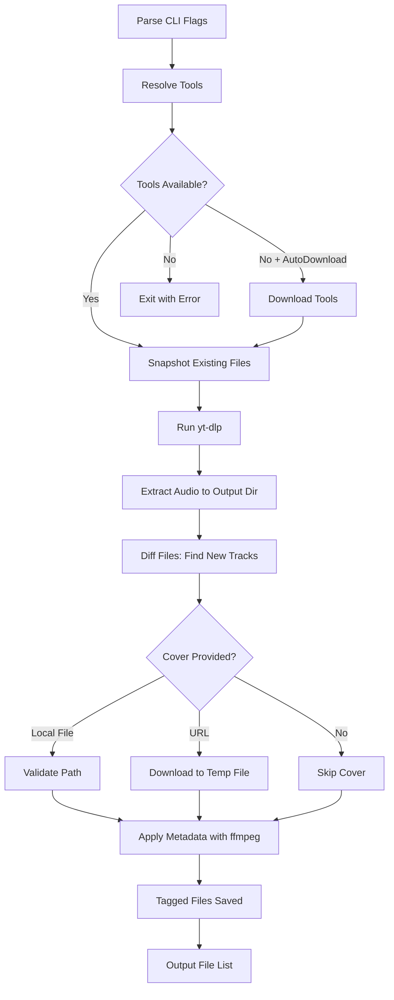

A zero-dependency Go CLI utility for downloading music from YouTube and embedding rich ID3 metadata. Download single videos or entire playlists, save as MP3 (or other audio formats), and automatically tag files with artist, album, year, cover art, and more.

## Features

- **YouTube Downloads**: Fetch single videos or complete playlists via `yt-dlp`
- **Highest Quality Audio**: Downloads at the highest available audio quality (VBR quality 0)
- **Audio Extraction**: Save as MP3 (default) or other audio formats to any target directory
- **Rich Metadata Embedding**: Apply ID3 tags including title, artist, album, album artist, composer, year/date, genre, track number, and comments
- **Per-Track Metadata**: Apply different metadata to each track in a playlist
- **MusicBrainz Integration**: Auto-fetch album and track metadata from MusicBrainz database
- **Cover Art Archive**: Automatically retrieve album cover art from Cover Art Archive
- **Cover Art Support**: Embed cover art from local files or URLs using `ffmpeg`
- **Batch Configuration**: Process multiple albums from a YAML configuration file
- **Safe Tagging**: Only files created by the current run are modified—existing files are never touched
- **Progress Feedback**: Beautiful turtle-themed progress indicators with real-time download and tagging status
- **Cross-Platform**: Supports Linux (x86-64, x86, ARM64), macOS (x86-64, ARM64), and Windows (x86-64, x86)

## Requirements

- **Go 1.25+** (for building from source)
- **External Tools** (required):
  - `yt-dlp` - YouTube downloader
  - `ffmpeg` - Audio conversion and metadata tagging
- **Network Access**: Required for YouTube and cover image URLs

### Installing Dependencies

**macOS** (using Homebrew):
```bash
brew install yt-dlp ffmpeg
```

**Ubuntu/Debian**:
```bash
sudo apt install yt-dlp ffmpeg
```

**Arch Linux**:
```bash
sudo pacman -S yt-dlp ffmpeg
```

**Windows** (using Chocolatey):
```bash
choco install yt-dlp ffmpeg
```

Or download manually from:
- [yt-dlp releases](https://github.com/yt-dlp/yt-dlp/releases)
- [ffmpeg downloads](https://ffmpeg.org/download.html)

## Installation

### Option 1: Using Make (Recommended)

```bash
git clone https://github.com/emmanuelviniciusdev/iTurtle-Smart-Fetcher.git
cd iTurtle-Smart-Fetcher

# Build for current platform
make build

# Or install to $GOPATH/bin
make install

# See all available commands
make help
```

### Option 2: Manual Build from Source

```bash
git clone https://github.com/emmanuelviniciusdev/iTurtle-Smart-Fetcher.git
cd iTurtle-Smart-Fetcher
go build -o iturtle-smart-fetcher ./cmd/iturtle-smart-fetcher
```

### Option 3: Install to GOPATH/bin

```bash
go install github.com/emmanuelviniciusdev/iTurtle-Smart-Fetcher/cmd/iturtle-smart-fetcher@latest
```

### Option 4: Download Pre-built Binary

Download the latest release for your platform from the [Releases](https://github.com/emmanuelviniciusdev/iTurtle-Smart-Fetcher/releases) page.

## Quick Start

### Download a Single Video

```bash
iturtle-smart-fetcher \
  -url "https://youtube.com/watch?v=VIDEO_ID" \
  -out ./music \
  -artist "Black Kids" \
  -album "Partie Traumatic" \
  -year 2008 \
  -genre "Indie Pop"
```

### Download a Full Playlist with Cover Art

```bash
iturtle-smart-fetcher \
  -url "https://youtube.com/playlist?list=PLAYLIST_ID" \
  -out ./downloads \
  -cover ./art/album.jpg \
  -artist "Black Kids" \
  -album "Partie Traumatic" \
  -year 2008 \
  -genre "Indie Pop"
```

### Using a Remote Cover Image

```bash
iturtle-smart-fetcher \
  -url "https://youtube.com/watch?v=abc123" \
  -cover "https://example.com/cover.jpg" \
  -artist "Artist Name"
```

### Fetch Metadata from MusicBrainz

```bash
# By MusicBrainz release ID
iturtle-smart-fetcher \
  -url "https://youtube.com/playlist?list=PLAYLIST_ID" \
  -musicbrainz-id "abc-123-def-456" \
  -out ./music

# Or auto-search by artist and album name
iturtle-smart-fetcher \
  -url "https://youtube.com/playlist?list=PLAYLIST_ID" \
  -auto-fetch-metadata "Black Kids - Partie Traumatic" \
  -out ./music
```

### Batch Mode with Configuration File

```bash
# Generate example configuration file
iturtle-smart-fetcher -example-config > albums.yaml

# Edit the file with your albums...

# Run batch download
iturtle-smart-fetcher -config albums.yaml
```

## CLI Reference

### Required Flags

| Flag | Description |
|------|-------------|
| `-url` | YouTube video or playlist URL (required unless `-config` is used) |

### Output Options

| Flag | Default | Description |
|------|---------|-------------|
| `-out` | `.` (current directory) | Directory where audio files will be saved |
| `-format` | `mp3` | Audio format (mp3 recommended for ID3 support) |
| `-cover` | (none) | Local path or URL to cover art image |

### Metadata Flags

| Flag | Description |
|------|-------------|
| `-title` | Song title (overrides YouTube title) |
| `-artist` | Artist name |
| `-album` | Album name |
| `-album-artist` | Album artist (for compilations) |
| `-composer` | Composer name |
| `-year` | Release year |
| `-genre` | Music genre |
| `-track` | Track number |
| `-comment` | Additional comments |

**Note on Metadata Behavior**: All metadata flags are optional. If a metadata field is not specified, the original metadata extracted by `yt-dlp` from YouTube (such as video title, uploader name, etc.) is preserved in the downloaded file. Only the metadata fields you explicitly provide will override the YouTube-extracted values.

### MusicBrainz Integration

| Flag | Description |
|------|-------------|
| `-musicbrainz-id` | MusicBrainz release ID to fetch album and track metadata |
| `-auto-fetch-metadata` | Auto-search MusicBrainz (format: "Artist - Album") |

When using MusicBrainz integration, the tool will:
- Fetch complete album metadata (title, artist, year, label, etc.)
- Retrieve per-track metadata (title, duration, ISRC, etc.)
- Automatically download cover art from Cover Art Archive if available

### Batch Configuration

| Flag | Description |
|------|-------------|
| `-config` | Path to YAML batch configuration file |
| `-example-config` | Print example configuration file and exit |

### Tool Path Overrides

| Flag | Default | Description |
|------|---------|-------------|
| `-yt-dlp-path` | (searches PATH) | Path to `yt-dlp` binary |
| `-ffmpeg-path` | (searches PATH) | Path to `ffmpeg` binary |

By default, the tool searches for `yt-dlp` and `ffmpeg` in your system PATH. Use these flags to specify custom locations if needed.

## Batch Configuration File

The batch configuration file allows you to process multiple albums in a single run. Create a YAML file with the following structure:

```yaml
# albums.yaml
albums:
  # Example 1: Manual metadata with per-track info
  - url: "https://youtube.com/playlist?list=PLxxxxxx"
    artist: "Black Kids"
    album: "Partie Traumatic"
    year: "2008"
    genre: "Indie Pop"
    cover: "https://example.com/cover.jpg"
    output_dir: "./music/Black Kids"
    tracks:
      - {num: 1, title: "Hit The Heartbrakes"}
      - {num: 2, title: "Partie Traumatic"}
      - {num: 3, title: "I'm Not Gonna Teach Your Boyfriend How to Dance with You"}

  # Example 2: Auto-fetch from MusicBrainz by ID
  - url: "https://youtube.com/playlist?list=PLyyyyyy"
    musicbrainz_id: "abc-123-def-456"
    output_dir: "./music/Motion City Soundtrack"

  # Example 3: Auto-search MusicBrainz
  - url: "https://youtube.com/playlist?list=PLzzzzzz"
    auto_fetch: "Motion City Soundtrack - Commit This to Memory"
    output_dir: "./music/Motion City Soundtrack"
```

### Configuration Fields

| Field | Required | Description |
|-------|----------|-------------|
| `url` | Yes | YouTube video or playlist URL |
| `artist` | No | Album artist |
| `album` | No | Album title |
| `album_artist` | No | Album artist (for compilations) |
| `year` | No | Release year |
| `genre` | No | Music genre |
| `cover` | No | Local path or URL to cover art |
| `output_dir` | No | Output directory (defaults to current directory) |
| `musicbrainz_id` | No | MusicBrainz release ID for auto-fetch |
| `auto_fetch` | No | Auto-search query (format: "Artist - Album") |
| `tracks` | No | Per-track metadata overrides |

### Track Configuration Fields

| Field | Description |
|-------|-------------|
| `num` | Track number/position |
| `title` | Track title |
| `artist` | Track artist (if different from album artist) |
| `composer` | Track composer |
| `duration` | Track duration |
| `comment` | Track comment |

## How It Works



### Detailed Flow

1. **Tool Resolution**: The CLI first resolves paths to `yt-dlp` and `ffmpeg` using the priority: explicit path flag → system PATH → auto-download (if enabled)

2. **Pre-download Snapshot**: Before downloading, the tool captures a list of all existing files with the target format in the output directory

3. **Audio Download**: Executes `yt-dlp` with flags:
   ```
   yt-dlp --extract-audio --audio-format mp3 --prefer-ffmpeg --yes-playlist --ignore-errors --no-continue --newline -o "%(title)s.%(ext)s" <URL>
   ```
   The `--prefer-ffmpeg` flag ensures audio is properly converted to the requested format (MP3) instead of falling back to .webm or other container formats.

4. **File Diff Detection**: After download, compares the new file list against the snapshot to identify only newly created files

5. **Cover Preparation**: If a cover is specified:
   - **Local path**: Validates the file exists
   - **URL**: Downloads to a temporary file (cleaned up after processing)

6. **Metadata Application**: For each new file, runs `ffmpeg` to embed ID3v2.3 tags and optional cover art:
   ```
   ffmpeg -y -i input.mp3 [-i cover.jpg] -map 0:a [-map 1] \
     [-c:v mjpeg -disposition:v:0 attached_pic] \
     -metadata artist="..." -metadata album="..." \
     -id3v2_version 3 output.mp3
   ```

## Tool Resolution Strategy

The tool manager follows this simple resolution order for both `yt-dlp` and `ffmpeg`:

```
1. Explicit Path (if provided via -yt-dlp-path or -ffmpeg-path)
   └─> Validate exists and is executable
       ├─> Found: Use it
       └─> Not found: Error

2. System PATH (default behavior)
   └─> exec.LookPath("yt-dlp" or "ffmpeg")
       ├─> Found: Use it
       └─> Not found: Error with installation instructions
```

**Example error message when tools are missing:**
```
❌ Tool setup failed: yt-dlp not found on PATH. Install it or use -yt-dlp-path to specify location
```

## Project Structure

```
iturtle-smart-fetcher/
├── cmd/
│   └── iturtle-smart-fetcher/
│       └── main.go              # CLI entry point, flag parsing, batch mode
├── internal/
│   ├── config/
│   │   ├── config.go            # YAML batch configuration parsing
│   │   └── config_test.go       # Configuration tests
│   ├── downloader/
│   │   ├── downloader.go        # Core download and tagging orchestration
│   │   ├── downloader_test.go   # Unit tests with mocked dependencies
│   │   ├── metadata.go          # Config, Metadata, and PlaylistMetadata types
│   │   ├── progress.go          # Turtle-themed progress printer
│   │   └── runner.go            # Command execution interface
│   ├── musicbrainz/
│   │   ├── musicbrainz.go       # MusicBrainz API client
│   │   ├── musicbrainz_test.go  # API client tests
│   │   ├── converter.go         # Convert MusicBrainz data to PlaylistMetadata
│   │   └── converter_test.go    # Converter tests
│   └── tools/
│       ├── tools.go             # Tool resolution
│       └── tools_test.go        # Unit tests
├── go.mod                       # Go module
├── go.sum                       # Dependency checksums
└── README.md
```

### Key Types

```go
// Config defines the parameters for a download run
type Config struct {
    URL              string            // YouTube video or playlist URL (required)
    OutputDir        string            // Output directory for downloads
    Cover            string            // Local file path or URL to cover image
    AudioFormat      string            // Audio format (default: "mp3")
    YtDLPPath        string            // Path to yt-dlp binary
    FFmpegPath       string            // Path to ffmpeg binary
    Metadata         Metadata          // Metadata to embed (uniform for all tracks)
    PlaylistMetadata *PlaylistMetadata // Per-track metadata for playlists
}

// Metadata holds ID3 tags to embed into audio files
type Metadata struct {
    Title       string
    Artist      string
    Album       string
    AlbumArtist string
    Composer    string
    Year        string
    Genre       string
    Track       string
    Comment     string
}

// PlaylistMetadata combines album-level and per-track metadata
type PlaylistMetadata struct {
    AlbumInfo AlbumMetadata
    Tracks    []TrackMetadata
}

// TrackMetadata holds per-track metadata for playlist downloads
type TrackMetadata struct {
    Position   int    // Track position in the playlist/album
    Title      string // Track title
    Duration   string // Track duration (e.g., "3:45")
    Artist     string // Track artist (if different from album artist)
    Composer   string // Track composer
    ISRC       string // International Standard Recording Code
    DiscNumber int    // Disc number for multi-disc albums
    TotalDiscs int    // Total number of discs
    Comment    string // Per-track comment
}
```

## Development

### Using the Makefile

The project includes a comprehensive Makefile for common development tasks:

```bash
# Show all available commands
make help

# Build for current platform
make build

# Install to $GOPATH/bin
make install

# Run tests
make test

# Run tests with coverage report
make test-coverage

# Format and lint code
make lint

# Build for all platforms
make build-all

# Create release packages
make release

# Run with example parameters
make run-example

# Clean build artifacts
make clean
```

**Common Make Targets:**

| Target | Description |
|--------|-------------|
| `make build` | Build binary for current platform to `./bin/` |
| `make install` | Install binary to `$GOPATH/bin` |
| `make test` | Run all tests |
| `make test-coverage` | Run tests and generate HTML coverage report |
| `make lint` | Format code and run go vet |
| `make clean` | Remove all build artifacts |
| `make build-all` | Build for Linux, macOS, and Windows (all architectures) |
| `make release` | Create release archives for all platforms |
| `make run ARGS="..."` | Build and run with custom arguments |
| `make dev ARGS="..."` | Run directly with `go run` (no build) |

### Testing

Run the test suite:

```bash
# Using make
make test

# Or directly with go
go test ./...
```

If you encounter cache permission issues:

```bash
GOCACHE=/tmp/go-build go test ./...
```

**Test Coverage:**

- **downloader**: URL validation, cover download with mock HTTP, ffmpeg argument construction, end-to-end download flow with fake command runner
- **tools**: Explicit path resolution, system PATH lookup, error handling for missing tools

Generate coverage report:

```bash
make test-coverage
# Opens coverage.html in your browser
```

## Troubleshooting

### Common Issues

| Problem | Solution |
|---------|----------|
| `yt-dlp not found on PATH` | Install yt-dlp: `brew install yt-dlp` (macOS) or see installation section |
| `ffmpeg not found on PATH` | Install ffmpeg: `brew install ffmpeg` (macOS) or see installation section |
| `yt-dlp failed` | Ensure the URL is reachable. Try updating: `yt-dlp -U` |
| `ffmpeg failed` | Verify `ffmpeg` supports MP3 metadata embedding: `ffmpeg -version` |
| `no new audio files found` | Check the output directory is writable and the video/playlist is public |
| `Files downloaded as .webm` | Ensure ffmpeg is installed and accessible; the tool uses `--prefer-ffmpeg` for conversion |
| `cover file: no such file` | Verify the cover path exists and is accessible |
| `download cover: unexpected status` | Check the cover URL is accessible and returns an image |

### Debug Tips

1. **Verify tools are accessible**:
   ```bash
   which yt-dlp ffmpeg
   yt-dlp --version
   ffmpeg -version
   ```

2. **Test yt-dlp manually**:
   ```bash
   yt-dlp --extract-audio --audio-format mp3 "https://youtube.com/watch?v=..."
   ```

3. **Specify custom tool paths if needed**:
   ```bash
   iturtle-smart-fetcher -url "..." -yt-dlp-path /custom/path/to/yt-dlp
   ```

## Limitations

- **External Dependencies**: Requires `yt-dlp` and `ffmpeg` to be installed separately (not pure Go implementations)
- **Audio Formats**: While other formats are supported, MP3 is recommended for best ID3 tag compatibility
- **Track Matching**: Per-track metadata matching relies on playlist order; tracks must be downloaded in the same order as specified in metadata
- **MusicBrainz Rate Limiting**: The MusicBrainz API limits requests to 1 per second; batch operations may take time for large collections

## Examples

### Download Album with Full Metadata

```bash
iturtle-smart-fetcher \
  -url "https://youtube.com/playlist?list=PLAYLIST_ID" \
  -out ./music \
  -artist "Black Kids" \
  -album "Partie Traumatic" \
  -album-artist "Black Kids" \
  -year "2008" \
  -genre "Indie Pop" \
  -cover "https://example.com/cover.jpg"
```

### Download Single Track with Metadata

```bash
iturtle-smart-fetcher \
  -url "https://youtube.com/watch?v=VIDEO_ID" \
  -out ./music \
  -title "I'm Not Gonna Teach Your Boyfriend How to Dance with You" \
  -artist "Black Kids" \
  -album "Partie Traumatic" \
  -year "2008" \
  -genre "Indie Pop" \
  -track "7"
```

### Use Custom Tool Paths

```bash
iturtle-smart-fetcher \
  -url "https://youtube.com/watch?v=abc123" \
  -yt-dlp-path /opt/yt-dlp/yt-dlp \
  -ffmpeg-path /opt/ffmpeg/bin/ffmpeg
```

## License

MIT License - see [LICENSE](LICENSE) for details.

## Contributing

Contributions are welcome! Please open an issue or submit a pull request.

1. Fork the repository
2. Create a feature branch (`git checkout -b feature/amazing-feature`)
3. Commit your changes (`git commit -m 'Add amazing feature'`)
4. Push to the branch (`git push origin feature/amazing-feature`)
5. Open a Pull Request
